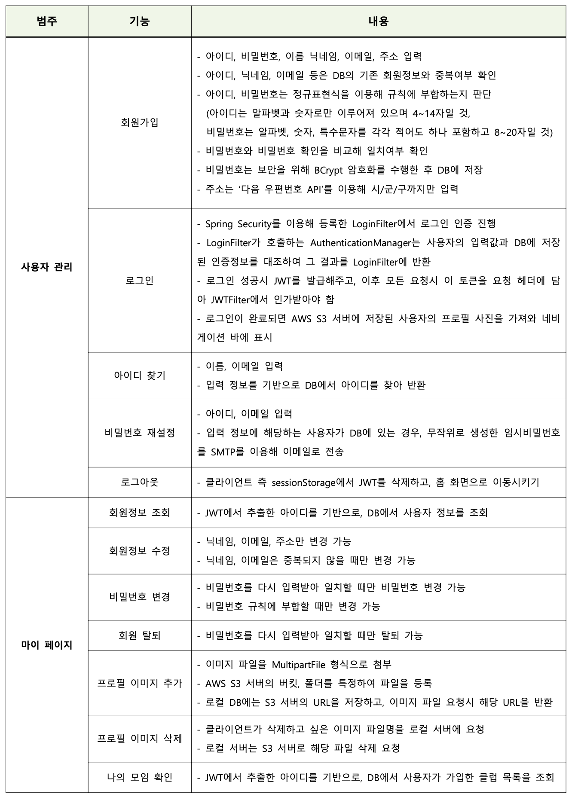
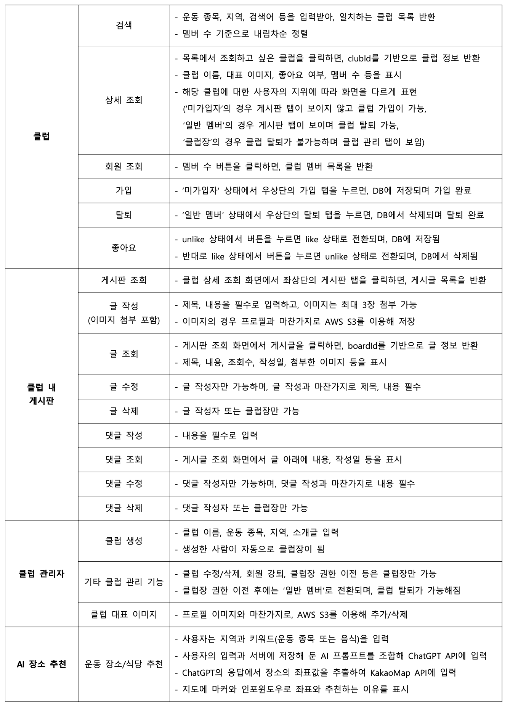
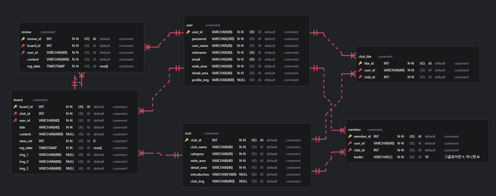
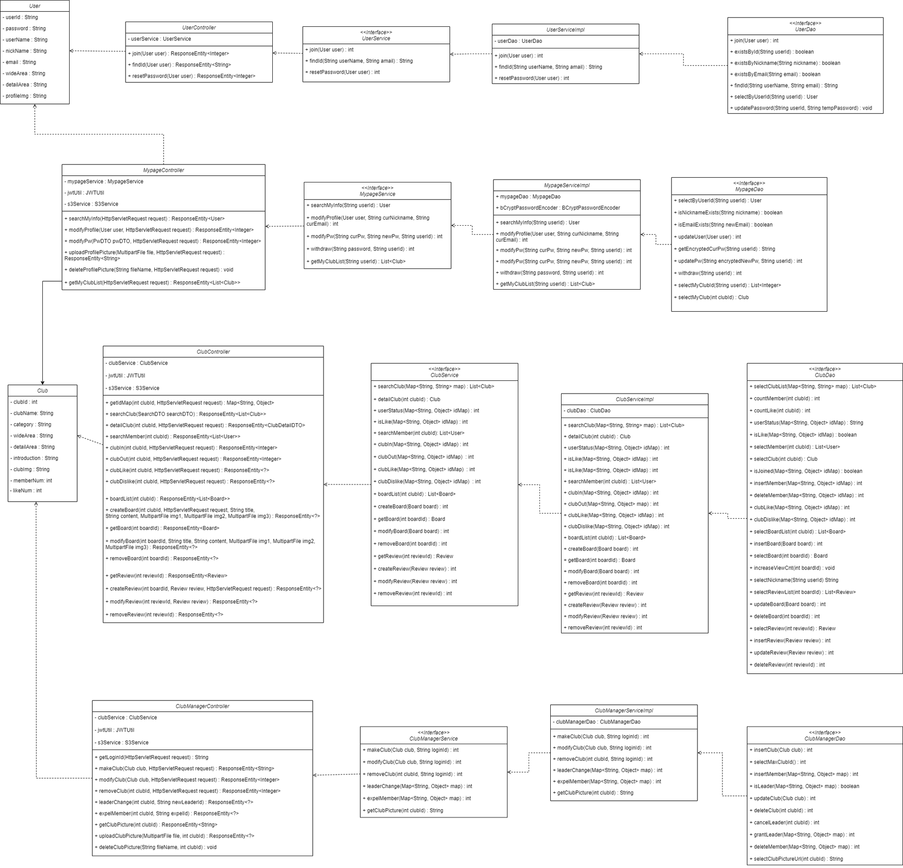
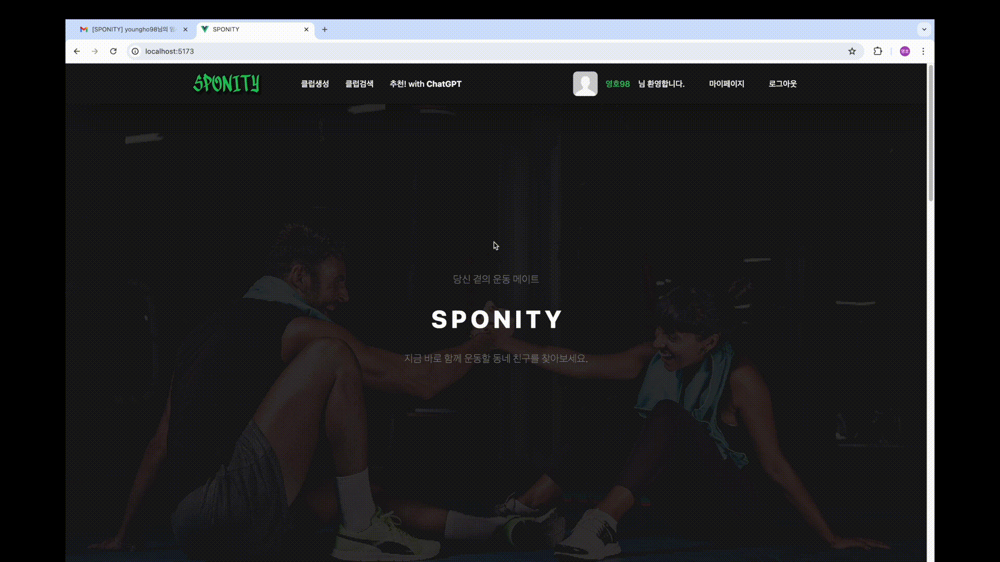

# SPONITY
본 프로젝트는 삼성 청년 SW 아카데미 1학기 관통 프로젝트 결과물입니다.

## 기획 배경 및 목표
### 기획 배경
- 운동을 매개로 이웃 간에 긍정적이고 따뜻한 관계를 형성하는 데 도움을 줄 수 있는 어플리케이션 개발
### 개발 목표
- '지역 기반 운동 클럽 커뮤니티' 플랫폼
- 누구나 사용하기 쉬운 사용자 친화적인 어플리케이션
- 개인정보가 필요한 서비스인만큼, 다양한 보안로직 추가

## 역할 분담
### 노영호 (youngho98)
- FrontEnd 메인 (Axios 연결, SPA 설계&구현, UI/UX 디자인 등) 
- BackEnd 서브 (REST API 설계, ERD 설계 등)
### 이규빈 (kevinlee94)
- BackEnd 메인 (REST API 구현 등)
- FrontEnd 서브 (홈 화면 디자인, 외부 API 도입 등)

## 기술 스택

### FrontEnd

### BackEnd

### Database

### Security

### API

### Collaboration Tools

## 주요 기능

## ERD 설계

## 클래스 다이어그램

## 실행 화면

### 메인 페이지

### 회원가입 & 로그인

### ID, 비밀번호 찾기 & 변경

### 프로필 이미지 업로드 & 삭제 (AWS S3 스토리지)

### 마이페이지 수정

### 회원탈퇴

### 클럽 생성

### 클럽 수정 & 대표 이미지 추가

### 클럽 가입 & 좋아요 & 게시판 보기

### 클럽 멤버 관리

### 나의 클럽 보기

### 게시글 작성 & 수정 & 삭제

### 댓글 작성 & 수정 & 삭제

### 이메일 불편접수

### ChatGPT 추천 기능 (운동 장소, 근처 맛집)

## 프로젝트 후기

> **노영호 (youngho98)**  
처음으로 진행한 프로젝트였는데 규빈이형과 함께 다양한 기능들도 넣어보고 다양한 기술들도 사용해보며 성공적으로 마무리 할 수 있어 좋았습니다. 
설계와 프론트 위주로 작업을 진행해보며, 프론트엔드 개발자의 입장에서 어떠한 형식으로 필요한 데이터를 받아오는 것이 좋을지 프론트에서 넘긴 데이터를 어떤식으로 DB에 저장해놓아야 좋을지 등을 생각해볼 수 있어 좋은 경험이 되었습니다. 
또한 하나의 기능을 추가하기 위해 프론트와 백에서 각각 어떠한 작업을 해야하는지 DB 설계는 어떻게 이루어지고 관리되어야 하는지를 생각해볼 수 있어 좋은 경험이 되었습니다. 
>> **추후 학습사항**  
>- 프로젝트에 사용했던 백엔드 파트 기술 추가 공부 (SpringSecurity, JWT, AWS S3 등)
>- REST API 추가 학습

> **이규빈 (kevinlee94)**  
첫 프로젝트라 막막했지만 페어인 영호가 잘 이끌어줘서 잘 마무리할 수 있었습니다. 
백엔드 담당자로서 RESTful API를 어떻게 설계해야 하고, 비즈니스 및 데이터 처리 로직을 어떻게 짜야 효율적인지 등에 대해 약간이나마 감을 잡을 수 있어서 좋았습니다.  
또한 프론트엔드 담당자와 어떻게 소통해야 하는지, 재사용 및 유지보수가 용이하고 클린한 코드가 무엇인지 고민하는 계기가 되었습니다. 
>> **추후 학습사항**  
>- git 공부
>- 백엔드 개발 역량 향상 (Java, Spring, RDBMS, SQL, ...)
>- HTTP에 대한 깊은 학습