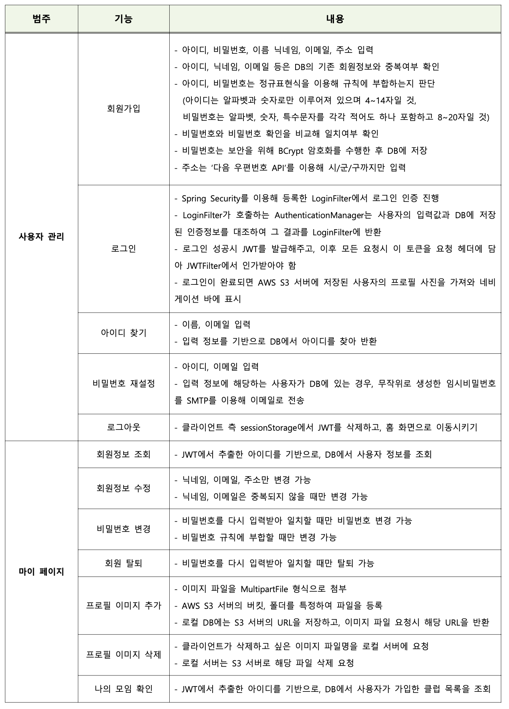
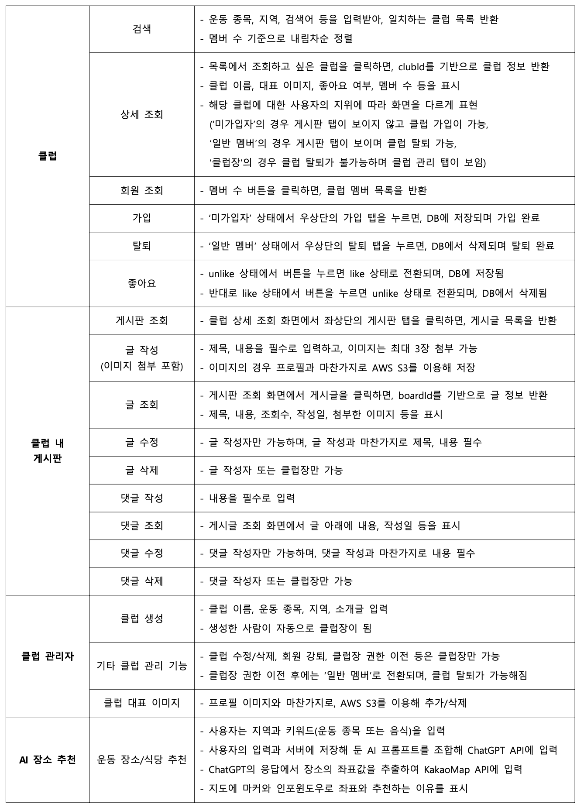
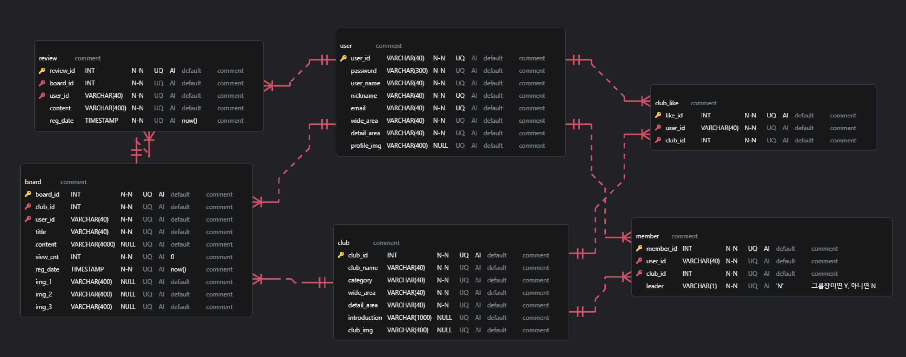
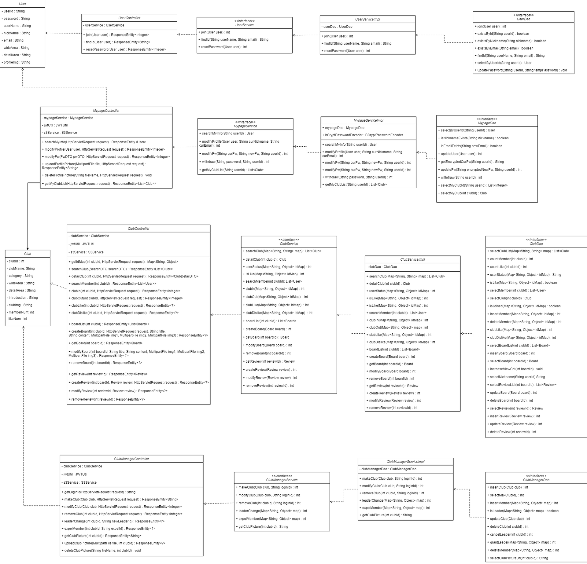
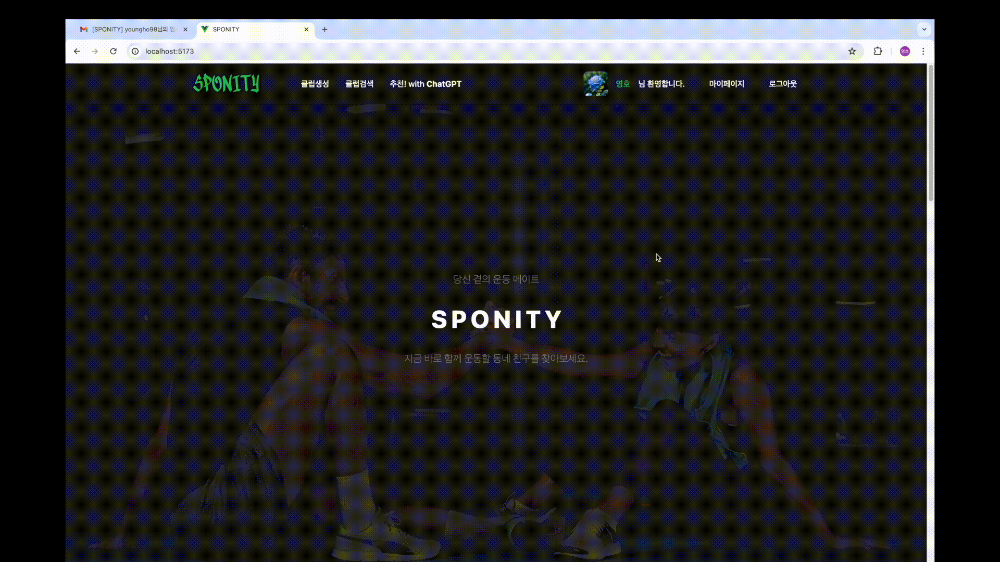
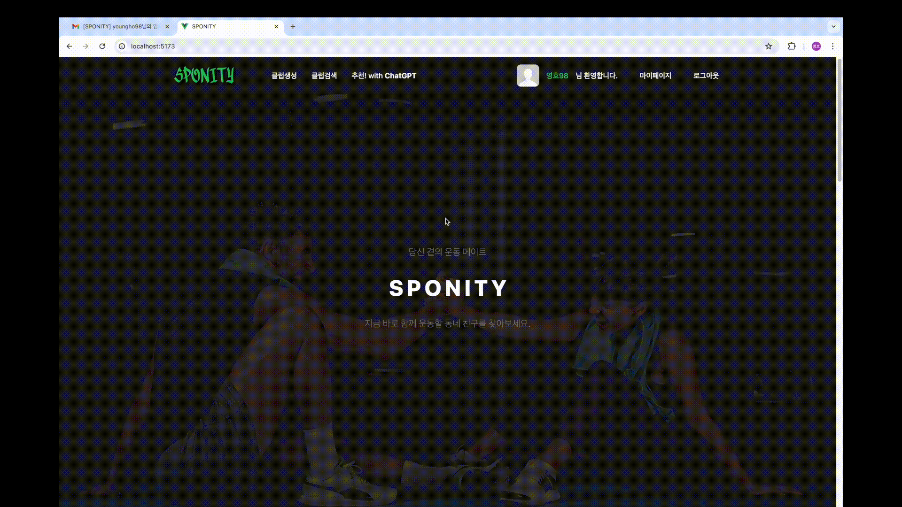

# SPONITY

## 기획 배경 및 목표

### 기획 배경

- 운동을 매개로 이웃 간에 긍정적이고 따뜻한 관계를 형성하는 데 도움을 줄 수 있는 어플리케이션 개발

### 개발 목표

- '지역 기반 운동 클럽 커뮤니티' 플랫폼
- 누구나 사용하기 쉬운 사용자 친화적인 어플리케이션
- 개인정보가 필요한 서비스인만큼, 다양한 보안로직 추가

## 기술 스택

<table style="width:100%; border-collapse:collapse; border:none;">
<tr>
<td style="width:50%; vertical-align:top; border:none;"">

<h3>FrontEnd</h3>

<h3>BackEnd</h3>

<h3>Database</h3>

</td>
<td style="width:50%; vertical-align:top; border:none;">

<h3>Security</h3>

<h3>API</h3>

<h3>Collaboration Tools</h3>

</td>
</tr>
</table>

## 주요 기능

## ERD 설계

## 클래스 다이어그램

## 실행 화면

### 메인 페이지

### 회원가입 & 로그인

### ID, 비밀번호 찾기 & 변경

### 프로필 이미지 업로드 & 삭제 (AWS S3 스토리지)

### 마이페이지 수정

### 회원탈퇴

### 클럽 생성

### 클럽 수정 & 대표 이미지 추가

### 클럽 가입 & 좋아요 & 게시판 보기

### 클럽 멤버 관리

### 나의 클럽 보기

### 게시글 작성 & 수정 & 삭제

### 댓글 작성 & 수정 & 삭제

### 이메일 불편접수

### ChatGPT 추천 기능 (운동 장소, 근처 맛집)

